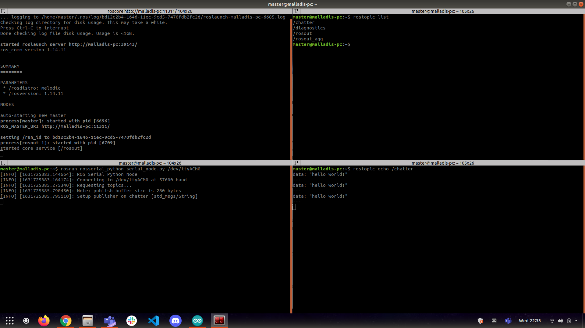
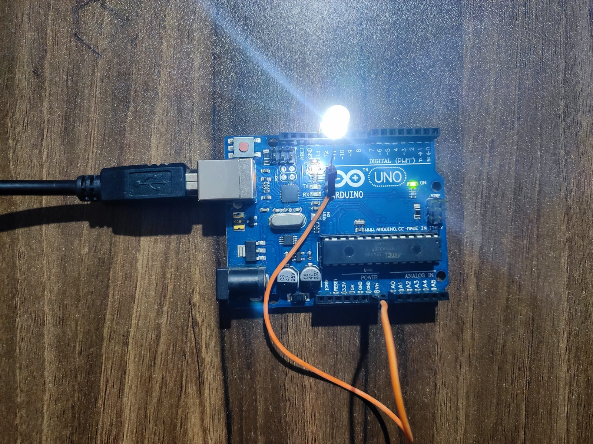
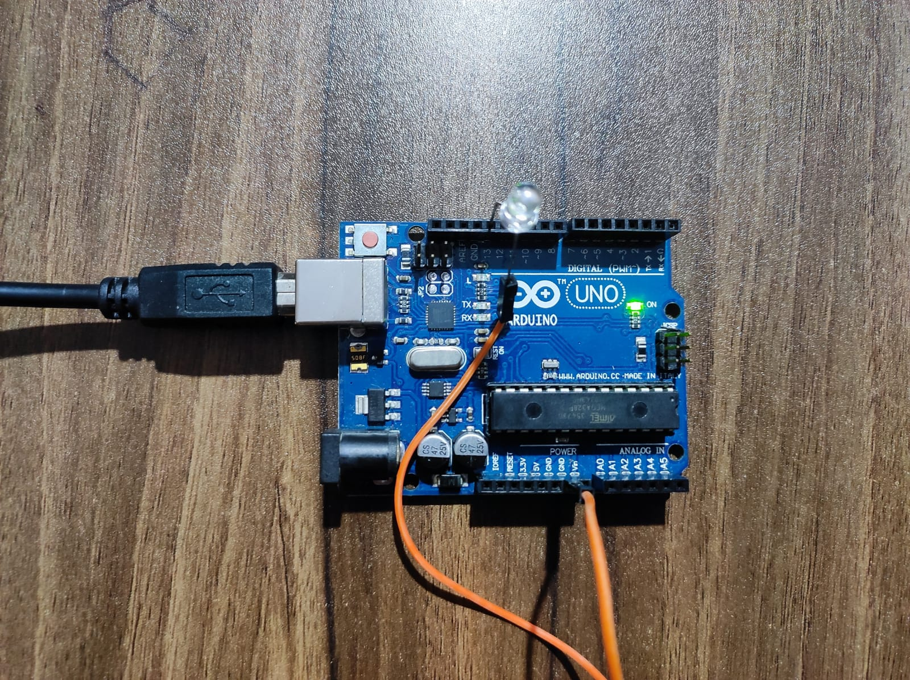
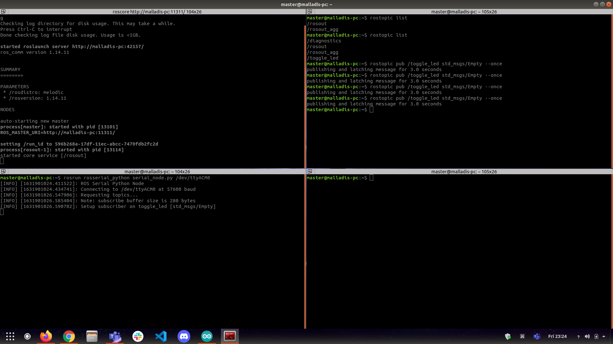

# Learning Objectives

**Task 2**

1. Making the Connection of Arduino with PC
2. Installing rosserial and ros lib
3. Trying the hello world example from the ROSSERIAL library

**Task 3**

1. Trying the blinking led example

# Tools Used

1. Arduino IDE
2. Arduino UNO
3. LED

# Procedure

**Task 2: Printing Hello world**

1. Installing the Arduino IDE from the official Arduino website: [https://www.arduino.cc/en/software](https://www.arduino.cc/en/software)
2. Following the steps in roswiki to setup Arduino and install the required libraries: [http://wiki.ros.org/rosserial_arduino/Tutorials/Arduino IDE Setup](http://wiki.ros.org/rosserial_arduino/Tutorials/Arduino%20IDE%20Setup)
3. Then install the ros_lib into the Arduino environment, this is done by running the following commands. 

    **Note**: This needs to be done in your sketchbook folder. (It is found from file → preference → sketchbook location)

    ```arduino
    cd <sketchbook>/libraries
    rm -rf ros_lib
    rosrun rosserial_arduino make_libraries.py
    ```

4. This installs all the required dependencies required for ROS to work in the Arduino
5. Now select the example code: HelloWorld (This is a publisher node example), Follow this link to understand the HelloWorld code [http://wiki.ros.org/rosserial_arduino/Tutorials/Hello World](http://wiki.ros.org/rosserial_arduino/Tutorials/Hello%20World)
6. Upload it to the Arduino
7. It won't start working right away. You need to run the node
8. Run these commands

    ```arduino
    roscore
    ```

    ```arduino
    rosrun rosserial_python serial_node.py <Enter_your_port
    _name>
    ```

This port name can be found in the Arduino IDE, Tools→port. 

And **Voila!**

The message from the Arduino will be sent to the pc. This can be seen by running the command

```arduino
rostopic echo /chatter
```



This is the final Result

**Task 3: Blinking LED**

1. Upload the blink example code from examples tab
2. Run these commands

    ```arduino
    roscore
    ```

    ```arduino
    rosrun rosserial_python serial_node.py <Enter_your_port
    _name>
    ```

This port name can be found in the Arduino IDE, Tools→port. 

Run this command which will toggle the state of the led

```arduino
rostopic pub toggle_led std_msgs/Empty --once
```

On running it once LED will turn on



And to turn it off run the same command again



This is how the terminal window looks 



# Result

1. video link