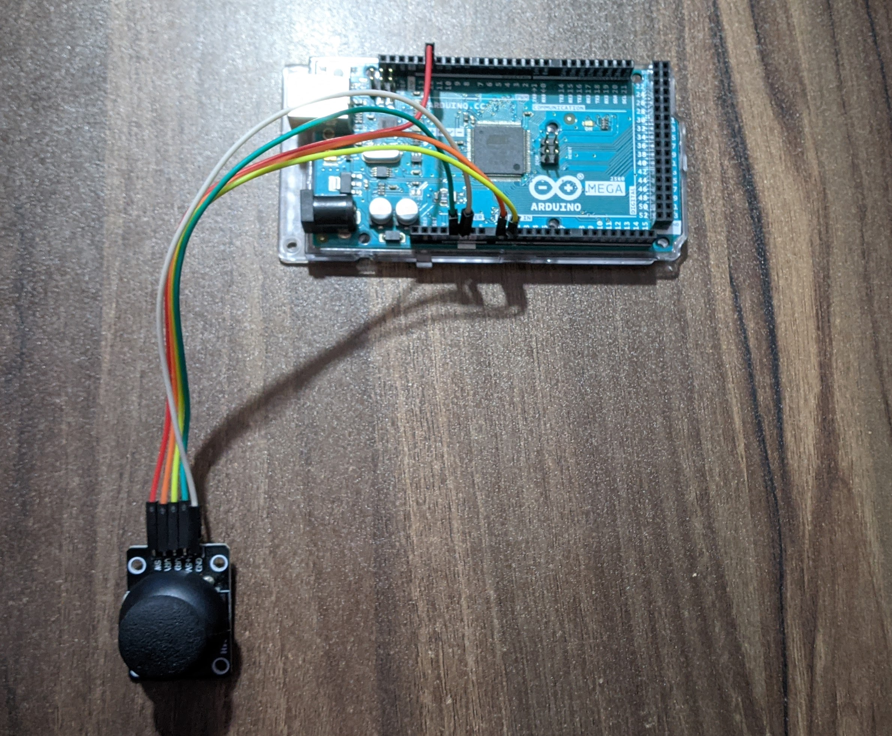
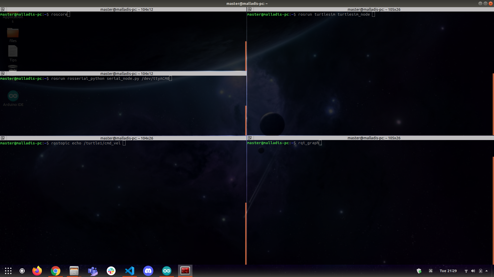
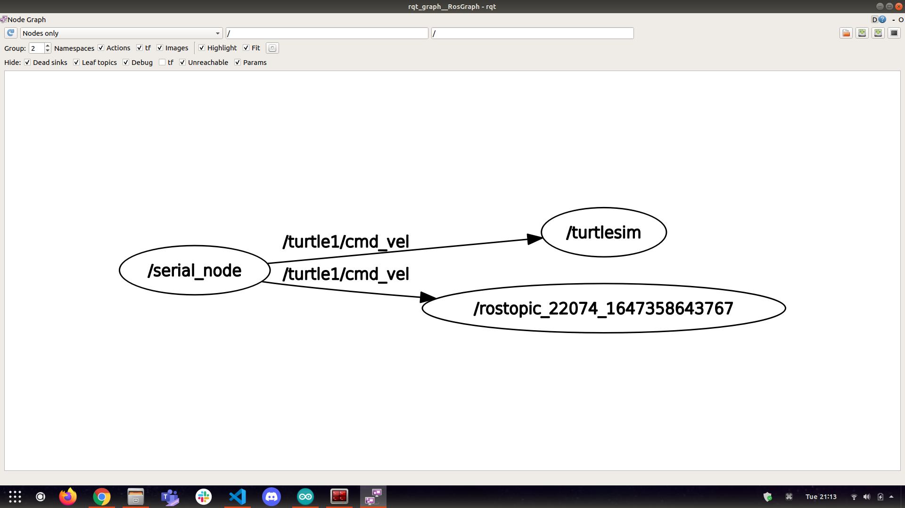

# Learning Objectives

**Task 5**

1. Control the turtle in turtlesim using the joystick
2. Learning about geometry_msgs 

# Tools Used

1. Arduino IDE
2. Arduino UNO
3. Joystick
4. Turtlesim

# Procedure

1. Make the circuit connection according to the pin diagram of the joystick


2. Start the ROS master by running ```roscore```
3. Upload the code to the arduino
4. Connect the arduino to the PC by the USB cable and to establish the connection run the following command
```
rosrun rosserial_python serial_node.py <Enter_your_port_name>
```
Eg. /dev/ttyACM0
5. Launch the turtlesim node by
```
rosrun turtlesim turtlesim_node
```
6. (Optional) To listen to the data being published by the Node is done running following command
```
rostopic echo /turtle1/cmd_vel 
```
7. The command window is as follows:


7. Now to control the turtle just move the joystick

And **Voila!**

8. The rqt_graph is as follows


# Result

Video link : https://youtu.be/WR1zD4wXk_I


