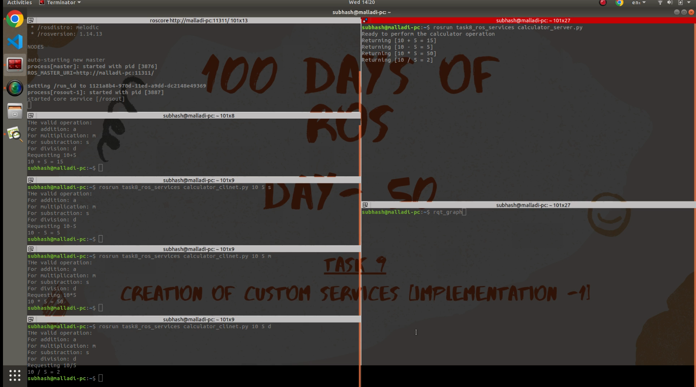

# Learning Objectives

1.  Understanding what is ROS services and how is it different from the other communication systems used in ROS
2.  Implementation of services by creating a calculator application


# Tools Used
1. Terminal

# Procedure


1.  A total of three files are responsible to run the calculator application using ROS services. A srv file, A server node, A client node
2.  The execution starts with running the master node 
```
    roscore
```
4.  The server node is executed by running the command
```
rosrun task9_ros_services calculator_server.py
```
1.  The client node is executed by running the command

For **addition**
```
rosrun task9_ros_services calculator_client.py <numbers to perform the operation> a
```

**Ex:** 
```
rosrun task9_ros_services calculator_client.py 5 10 a
```
For **subtraction**
```
rosrun task9_ros_services calculator_client.py <numbers to perform the operation> s
```
For **multiplication**
```
rosrun task9_ros_services calculator_client.py <numbers to perform the operation> m
```
For **division**
```
rosrun task9_ros_services calculator_client.py <numbers to perform the operation> d
```
And **Voila!**

Now a calculator is ready where the client request for the operation to be done on the values and the server responds back with the results.

This can be translated to the robot usecase, where a clinet_node requests for the different states of the robot and the server_node running on the robot responds with the feedback of the operation being performed and its state.

# Result


**video link**: https://youtu.be/uWQ5ugQ2oVw
